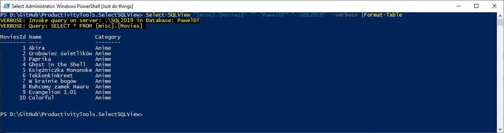
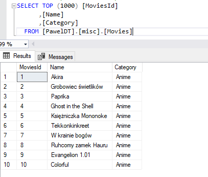
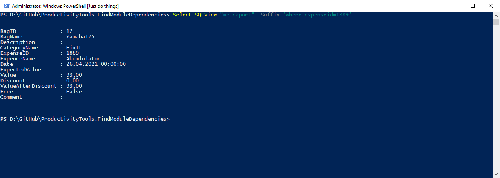

<!--Category:Powershell,SQL--> 
 <p align="right">
    <a href="https://www.powershellgallery.com/packages/ProductivityTools.SelectSQLView/"></a>
    <a href="http://productivitytools.tech/select-sql-view/"><a> 
    <a href="https://github.com/pwujczyk/ProductivityTools.SelectSQLView"></a>
</p>
<p align="center">
    <a href="http://productivitytools.tech/">
        
    </a>
</p>


# Select SQL View
It allows to quickly select view or table from SQL Server. 
<!--more-->
```PowerShell
Select-SQLView -Name "[misc].[Movies]" -DatabaseName PawelDT -ServerName .\sql2019
```
<!--og-image-->


The same data as above in SQL



You could save your server name and database name in the MasterConfiguration so it won't be needed to pass them later.


```PowerShell
Select-SQLView -Name "[misc].[Movies]"
```

The module allows also to add where and order by with **suffix** keyword.

```PowerShell
sq "me.raport" -Suffix 'where expenseid=1889' -Verbose
```



### Alias SQ
Module imports also alias sq.

```PowerShell
sq "[misc].[Movies]"
```