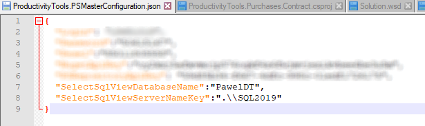

<!--Category:Powershell,SQL--> 
 <p align="right">
    <a href="https://www.powershellgallery.com/packages/ProductivityTools.PSSelectSQLView/"></a>
    <a href="http://productivitytools.tech/select-sqlview/"><a> 
    <a href="https://github.com/pwujczyk/ProductivityTools.PSSelectSQLView"></a>
</p>
<p align="center">
    <a href="http://productivitytools.tech/">
        
    </a>
</p>


# ProductivityTools.PSSelectSQLView
It allows to quickly select view or table from SQL Server. 

```powershell
Select-SQLView -Name me.raport -DatabaseName PawelDT -ServerName .\sql2019
```

You could save your server name and database name in the MasterConfiguration so it won't be needed to pass them later.



```powershell
Select-SQLView me.raport
```
